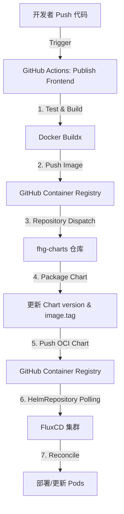

# fhg-frontend

Frontend application for the `flux-helm-github` stack. Built with Next.js.

## Directory Structure

```text
fhg-frontend/
├── .github/workflows/    # CI/CD pipeline
├── src/                  # Application source code
├── Dockerfile            # Production build configuration
└── package.json          # Dependencies and scripts
```

## GitOps 自动化部署流程 (Automated Deployment)

本项目采用完整的 GitOps 工作流，通过 GitHub Actions 与 FluxCD 实现自动化部署。

### 1. 流程图示



### 2. 构建与发布细节 (CI/CD Details)

- **流水线名称**: `Publish Frontend Release` ([docker-publish.yml](.github/workflows/docker-publish.yml))
- **触发条件**: `main` 分支有代码推送，或手动触发 `workflow_dispatch`。
- **关键阶段**:
    1.  **代码构建**: 执行 `npm run build` 确保 Next.js 应用可以成功编译。
    2.  **版本计算**: 基于 Git Tag 自动增加语义化版本号（如 `v0.0.1` -> `v0.0.2`）。
    3.  **多架构构建**: 使用 Buildx 同时构建 `linux/amd64` 和 `linux/arm64` 镜像。
    4.  **镜像托管**: 镜像发布至 `ghcr.io/liuyenhui/fhg-frontend`。
    5.  **跨仓库联动**: 成功推送镜像后，流水线会使用 `CHARTS_REPO_TOKEN` 向 `fhg-charts` 仓库发送信号，触发 `fhg-frontend-chart` 的自动更新。

### 3. 环境配置要求

> [!IMPORTANT]
> 为了使自动化流程正常工作，必须在仓库的 **Actions Secrets** 中配置：
> - `CHARTS_REPO_TOKEN`: 具有 `repo` 和 `workflow` 权限的个人访问令牌 (PAT)，用于触发 Chart 仓库的同步。

## Local Development

```bash
npm install
npm run dev
```

## Production Build

```bash
npm run build
npm run start
```
